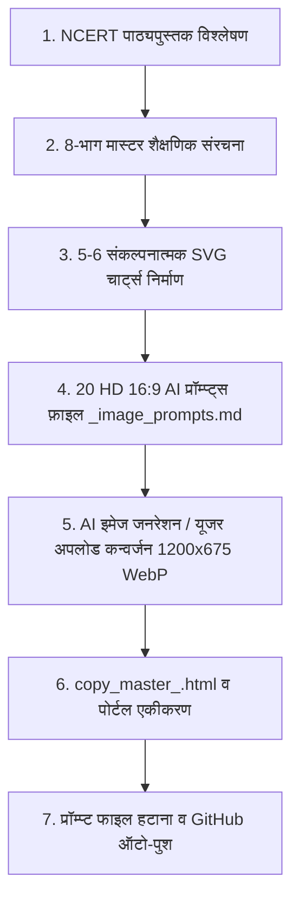

# 🧠 NCERT कक्षा 10 सामाजिक विज्ञान - मास्टर ऑटोमेशन एवं निर्माण प्रोटोकॉल (BRAIN.md)

यह दस्तावेज़ कक्षा 10 सामाजिक विज्ञान (अर्थशास्त्र, भूगोल, इतिहास, राजनीति विज्ञान) के सभी अध्यायों के निर्माण, विज़ुअल डिज़ाइन, AI इमेज जनरेशन एवं गिट सिंक हेतु **स्थायी स्वचालित कार्यप्रणाली (Permanent Operational Blueprint)** है।

---

## 🎯 1. संपूर्ण अध्याय निर्माण जीवन-चक्र (Chapter Lifecycle Workflow)

प्रत्येक नए अध्याय के प्रारंभ पर एजेंट को बिना दोबारा निर्देश दिए निम्नलिखित 7 चरणों का स्वचालित रूप से पालन करना है:



---

## 📐 2. दृश्य संपत्तियों का मानक (Visual & Asset Standards)

### A. 20 AI वास्तविक तस्वीरें (Realistic Visuals):
- **अनुपात (Aspect Ratio):** ठीक **16:9 (1200 × 675 पिक्सल, WebP प्रारूप)**।
- **100% टेक्स्ट-फ्री (Zero Gibberish Rule):** इमेज के अंदर कोई भी शब्द, अक्षर, संख्या, वॉटरमार्क या साइनेज नहीं होना चाहिए।
- **कक्षा-उपयुक्त (Classroom Safe):** भारतीय परिवेश, शालीन, गरिमामय और प्रेरणादायक दृश्य।

### B. 5+ संकल्पनात्मक डेटा-संचालित SVG चार्ट्स:
- **कैनवास:** `1100 × 650` पिक्सल।
- **थीम:** डार्क-मोड ग्रेडिएंट बैकग्राउंड (`#0f172a` से `#1e293b`)।
- **मास्टर बैनर:** `x="40" y="18" width="1020" height="54" rx="14"`
- **शब्दावली:** उच्च कंट्रास्ट, कोई टेक्स्ट ओवरलैप नहीं, विषयवार सामंजस्यपूर्ण रंग पैलेट।
- **विशेष पाठ्यपुस्तक डायग्राम्स:** आवश्यकतानुसार पाठ्यपुस्तक के विशेष डायग्राम्स (उदा. भरे हुए चेक का नमूना, प्रवाह चित्र) भी SVG में तैयार करना।

---

## 🤝 3. AI कोटा एवं सहयोगी अपलोड प्रोटोकॉल (Collaborative Image Protocol)

1. **प्रॉम्प्ट फ़ाइल का निर्माण:**
   - अध्याय शुरू होते ही `<chapter_id>_image_prompts.md` फ़ाइल बनेगी जिसमें सभी 20 प्रॉम्प्ट्स और शीर्ष पर **प्रगति ट्रैकर तालिका** होगी।
2. **कोटा प्रबंधन एवं अपलोड प्रक्रिया:**
   - एजेंट पहले उपलब्ध कोटा से जनरेट करेगा। कोटा समाप्त होने पर यूजर द्वारा प्रदान की जाने वाली इमेजेस को `.user_uploaded/` से तुरंत रीड करके:
     - 1200×675 रेजोल्यूशन में लांसोस (LANCZOS) रिसाइज करना।
     - 90% क्वालिटी WebP में `images/<chapter_id>/` में सेव करना।
     - प्रॉम्प्ट फ़ाइल में उस संख्या को **✅ पूर्ण (Done)** मार्क करना।
3. **कार्य समाप्ति पर:**
   - सभी 20 इमेजेस पूर्ण होने के बाद प्रॉम्प्ट फाइल को डिलीट करना और `GLOBAL_ASSET_REGISTRY.json` को रीबिल्ड करना।

---

## 💻 4. मास्टर नोट्स फ़ाइल संरचना (copy_master_<ch>.html)

- **टाइपोग्राफी नियम:**
  - `font-size: 26pt !important;` (प्रोजेक्टर फ्रेंडली)
  - `font-weight: 900 !important;`
  - `-webkit-text-stroke: 1.1px #000000;`
  - `line-height: 2.0 !important;`
- **घटक व स्टाइलिंग:**
  - `.hero-title` : मुख्य अध्याय शीर्षक बॉक्स।
  - `.part-header` : 8 भागों के बड़े हेडर।
  - `.concept-card` : संकल्पना बॉक्स।
  - `.fact-box` : परीक्षा सूत्र व मुख्य तथ्य।
  - `.warn-box` : महत्वपूर्ण चेतावनियां (जैसे ऋण-जाल, असंतुलन)।
  - `.fraction-box` : गणितीय सूत्रों का HTML/CSS भिन्न रूप।
  - `table.data-table` : तुलनात्मक तालिकाएं (जैसे औपचारिक vs अनौपचारिक, सलीम vs स्वप्ना)।

---

## 🔗 5. सिस्टम एवं पोर्टल एकीकरण (Portal Mappings)

- `notes_copy_view.html` के `titleMap` में नए अध्याय की आईडी जोड़ना।
- `notes_html_view.html` के `chapterNames` में नाम जोड़ना।
- `python scripts/asset_registry_tool.py --build` चलाकर सभी एसेट्स को इंडेक्स करना।
- गिट कमिट एवं पुश:
  ```bash
  git add .
  git commit -m "Complete Master Notes for <chapter> with 25+ visual assets"
  git push origin main
  ```

---

## 🚀 6. आगामी अध्यायों की पाइपलाइन (Chapter Roadmap)

1. ✅ **अर्थशास्त्र अध्याय 1:** विकास (Development)
2. ✅ **अर्थशास्त्र अध्याय 2:** भारतीय अर्थव्यवस्था के क्षेत्रक (Sectors of the Indian Economy)
3. ✅ **अर्थशास्त्र अध्याय 3:** मुद्रा और साख (Money and Credit)
4. ⏳ **अर्थशास्त्र अध्याय 4:** वैश्वीकरण और भारतीय अर्थव्यवस्था (Globalization and the Indian Economy)
   - *मुख्य विषय:* बहुराष्ट्रीय कंपनियां (MNCs), विदेशी व्यापार और बाजारों का एकीकरण, वैश्वीकरण के प्रेरक कारक (प्रौद्योगिकी, सूचना एवं संचार क्रांति - ICT), व्यापार का उदारीकरण (Liberalization), विश्व व्यापार संगठन (WTO), भारत में वैश्वीकरण का प्रभाव (प्रतिस्पर्धा, लाभान्वित vs पीड़ित), न्यायसंगत वैश्वीकरण की दिशा।
5. ⏳ **अर्थशास्त्र अध्याय 5:** उपभोक्ता अधिकार (Consumer Rights)
